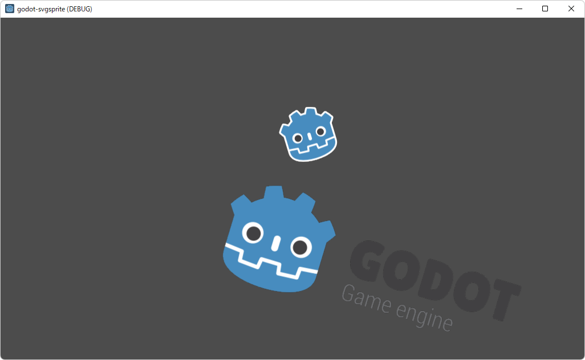

# godot-svgsprite
GDExtension addon for dynamic svg rendering  
Please use "master" branch for Godot 3.


## How to use
### Build
1. Clone this repository  
   (Current directory=project root)
   ```
   git clone -b gdextension https://github.com/heppocogne/godot-svgsprite --recursive
   cd godot-svgsprite
   ```
2. Build godot-cpp library  
   For more information, please check the [official documentation](https://docs.godotengine.org/en/stable/tutorials/scripting/gdnative/gdnative_cpp_example.html).  
   (Current directory=project root)
   ```
   cd cpp/godot-cpp
   scons platform=<platform> generate_bindings=yes target=editor/template_debug/template_release
   ```
   (wait a minute)
    
   ```
   cd ../
   ```
3. Build lunasvg library  
   (Current directory=cpp/)
   ```
   mkdir lunasvg_build
   cd lunasvg_build
   cmake -DCMAKE_BUILD_TYPE=Debug/Release -G Ninja ../lunasvg
   ninja
   cd ../../
   ```
4. Build godot-svgsprite library  
   (Current directory=project root)
   ```
   mkdir bin
   scons platform=<platform> target_name=libgodot-svgsprite target=editor/template_debug/template_release
   ```

### Enjoy the demo project!

### Install addon
1. Copy "addons" and "bin" folders to your project folder  
   
2. Project > ProjectSetting > Plugins: Activate SVGSprite plugin  
   

### Export project
When you export your project or resource package(\*.pck,\*.zip), make sure to add **"_rawsvg/*"** folder as a **"non-resource folder"**.


### Note
Note that this addon uses [lunasvg](https://github.com/sammycage/lunasvg) for svg rasterization, but godot4.x uses [thorvg](https://github.com/thorvg/thorvg), so the rendering result may not be the same.
